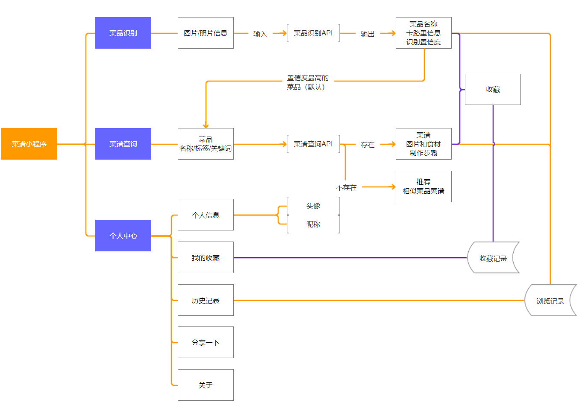
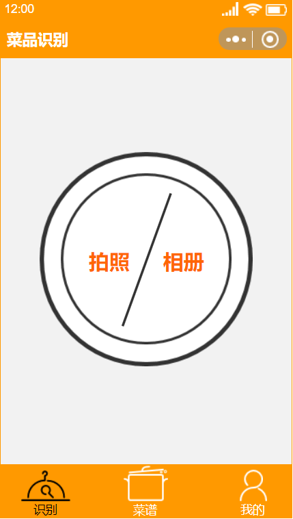
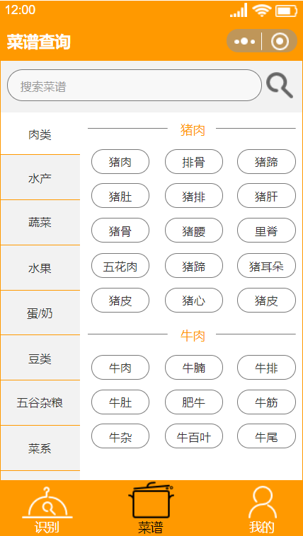

# API_ML_AI

## 产品要求
| 发布日期 | 12/31/2018 |
| --------   | -----:  |
| 史诗 | 菜谱小程序 |
| 文档状态| 基本完成 |
| 文件主人 | Chen |
| 设计者  | Chen |
| 开发者  | Chen |
| 测试者  | Chen |

## 目标
* 为用户提供菜品识别和菜谱查询的实用功能。
* 后期还可加入根据用户口味智能推荐菜品和菜谱的功能，菜品搭配方案推荐功能。

## 背景和战略契合处
* 目前小程序市场上的菜谱类小程序，多以单一菜品识别或菜谱查询作为主要功能，没有将二者结合提供便利的识别查询一体式功能。
* 家中父母时常只会做自己拿手的菜，菜品种类少，即使好吃也因为重复太多而失去食欲。看到好吃的菜品，却不知道菜名，菜谱也就无从查起，希望通过照片/图片识别出菜名，给出详细菜谱，方便父母参照食谱制作菜品，同时三餐的菜品搭配也是一大难题，希望有合理的菜品搭配方案。
* 做菜爱好者希望获取菜谱，自己动手制作菜品。

## 假设
* 用户使用菜品识别，识别生活中拍照所得的菜肴图片，或从微信朋友圈分享得到的菜肴图片，得到菜品名称，以及相应的菜谱。
* 使用[百度细粒度图像识别-菜品识别API](https://cloud.baidu.com/product/imagerecognition/fine_grained)和[聚合数据菜谱大全](https://www.juhe.cn/docs/api/id/46)结合Python实现功能。

## 加值宣言
菜谱小程序的核心功能基于百度菜品识别API与聚合数据菜谱大全API的调用，为用户提供菜品识别与菜谱查询的实用功能。

## 核心价值
菜谱小程序的核心价值在于识别菜品名称与查询相应的菜谱，帮助用户解决找菜名难，找菜谱难问题，提供菜品与菜谱综合查询的功能。

## 用户痛点
菜谱小程序主要针对以下用户痛点：
* 看到好吃的菜或菜的图片，想知道菜名却不知道怎么搜索。
* 知道了菜名，想要自己动手做，但不知道这道菜的菜谱。

## 人工智能概率性
在菜品识别和菜谱查询上难免出现失败情况，在菜品识别阶段失败，则给予用户幽默调侃的反馈，在菜谱查询阶段失败，则推荐相似的菜品菜谱。(详见[Axure原型展示及交互](https://wordlesssoda.github.io/API_ML_AI_Prototype/))

## 需求
| # | 标题 | 用户案例 | 重要程度 | 笔记 |
| -------- | ----- | ---- | -------- | ----- |
| 1 | 菜品识别 | 用户拍摄或上传菜肴图片，识别菜品，显示可能的菜品。 | 重要 | [百度菜品识别技术文档](https://ai.baidu.com/docs#/ImageClassify-Python-SDK/14a3e0b6) |
| 2 | 菜谱查询 | 根据用户输入或识别的菜品，列出需要的食材与制作步骤。 | 重要 |[聚合数据菜谱大全](https://www.juhe.cn/docs/api/id/46)|
| 3 | 菜品搭配推荐 | 为用户推荐与输入或识别的菜品相关的搭配，可以详细列出菜品搭配菜单。 | 一般 | 推荐系统 |
| 4 | 口味推荐 | 根据用户选择的自己偏爱的口味，系统推荐菜品。 | 一般 |  |

## 问题
| 问题 | 结果 |
| -------- | ----- |
| 我如何知道这道菜的名字？ | 拍摄或上传图片，识别菜品的名称。 |
| 我已经知道了菜的名字，但我想学怎么做？ | 根据菜名给出菜谱。 |
| 我不知道该怎么搭配这道菜？ | 推荐与之合理搭配的菜单。 |

## 使用者交互及设计
> ### [Axure原型文件下载](https://github.com/WordlessSoda/API_ML_AI_Prototype/blob/master/API_ML_AI_Prototype.rp)
> ### [Axure原型展示及交互](https://wordlesssoda.github.io/API_ML_AI_Prototype/)

### 产品结构图


### 产品信息结构图


### 基本页面


* 点击拍照/相册分别进入相应的页面。

---


* 点击搜索可搜索菜谱，也可在提供的分类菜单中自由选择。

---


* 点击相应位置分别进入个人信息与收藏、历史、分享等页面。
---
## API的输入与输出

> ### [API输入输出详细文档](API_Python/API_usage_demo.ipynb)

### 百度细粒度图像识别——菜品识别API
> [百度菜品识别API文档](https://ai.baidu.com/docs#/ImageClassify-Python-SDK/14a3e0b6)

* 输入：一张图片
* 输出: 图片的菜品名称、卡路里信息、置信度

#### 菜品识别示例：
* 输入:皮蛋瘦肉粥图片


* 输出

```
{
	"log_id": "5608140318891167761",
	"result_num": 5,
	"result": [
		{
			"calorie": "214",
			"has_calorie": true,
			"name": "皮蛋瘦肉粥",
			"probability": "0.921466"
		},
		{
			"calorie": "27",
			"has_calorie": true,
			"name": "海鲜粥",
			"probability": "0.0273665"
		},
		{
			"calorie": "31",
			"has_calorie": true,
			"name": "蔬菜粥",
			"probability": "0.00870583"
		},
		{
			"calorie": "96",
			"has_calorie": true,
			"name": "糖粥",
			"probability": "0.00774943"
		},
		{
			"calorie": "85",
			"has_calorie": true,
			"name": "八宝粥",
			"probability": "0.00583806"
		}
	]
}
```

### 聚合数据菜谱大全API

>[聚合数据菜谱大全API技术文档](https://code.juhe.cn/docs/1044)

* 输入：菜品名称/关键词
* 输出: 菜谱图片，食材，制作步骤

#### 菜谱大全示例：

* 输入：皮蛋瘦肉粥

* 输出：

```
{
	"resultcode":"200",
	"reason":"Success",
	"result":{
		"data":[
			{
				"id":"13653",
				"title":"猪肝皮蛋瘦肉粥",
				"tags":"粥;补血;护肝;10分钟内;春季;熬;鲜香;补铁;全菜系;1-2人;缺铁性贫血;味道鲜美;养肝护肝;补肝;补锌;锅子",
				"imtro":"粤菜经典菜式，老少皆宜，而且操作简单，更能随心搭配。",
				"ingredients":"瘦肉,100g;猪肝,100g;粥,600g;皮蛋,1个;鸡蛋,1个",
				"burden":"油,适量;盐,适量;葱花,适应",
				"albums":[
					"http:\/\/juheimg.oss-cn-hangzhou.aliyuncs.com\/cookbook\/t\/14\/13653_996310.jpg"
				],
				"steps":[
					{
						"img":"http:\/\/juheimg.oss-cn-hangzhou.aliyuncs.com\/cookbook\/s\/137\/13653_60a084f638b3e708.jpg",
						"step":"1.猪肉剁成肉末，撒点薄盐"
					},
					{
						"img":"http:\/\/juheimg.oss-cn-hangzhou.aliyuncs.com\/cookbook\/s\/137\/13653_5c9eb3a723fa2425.jpg",
						"step":"2.猪肝加点盐，用水洗干净待用"
					},
					{
						"img":"http:\/\/juheimg.oss-cn-hangzhou.aliyuncs.com\/cookbook\/s\/137\/13653_c73bc5437a72ed32.jpg",
						"step":"3.新鲜鸡蛋一个"
					},
					{
						"img":"http:\/\/juheimg.oss-cn-hangzhou.aliyuncs.com\/cookbook\/s\/137\/13653_0f8770e46f3722e4.jpg",
						"step":"4.煮熟的粥，浓稠看自己的喜欢，但不建议太稠，因为等下要下很多的配料"
					},
					{
						"img":"http:\/\/juheimg.oss-cn-hangzhou.aliyuncs.com\/cookbook\/s\/137\/13653_354c4013622df076.jpg",
						"step":"5.皮蛋尽量切小"
					},
					{
						"img":"http:\/\/juheimg.oss-cn-hangzhou.aliyuncs.com\/cookbook\/s\/137\/13653_4daa546a303eba5a.jpg",
						"step":"6.把粥和皮蛋拌匀并放入少许食用油，避免粘锅，然后中火煮开"
					},
					{
						"img":"http:\/\/juheimg.oss-cn-hangzhou.aliyuncs.com\/cookbook\/s\/137\/13653_e9547f6d2c2cc15a.jpg",
						"step":"7.煮开后，可放入肉末（肉末撒点冷水，打散），并用大勺拌匀，注意不要粘锅。"
					},
					{
						"img":"http:\/\/juheimg.oss-cn-hangzhou.aliyuncs.com\/cookbook\/s\/137\/13653_03e489cb2f85dd97.jpg",
						"step":"8.依次放入猪肝以及鸡蛋，并调料，最后撒入葱花即可出锅了。"
					}
				]
			},
			{
				"id":"18070",
				"title":"皮蛋瘦肉粥",
				"tags":"粥;健脾开胃;养胃;增肥;儿童;老年人;骨质疏松;煮;补钙;补中益气;健脾;补虚;健脾胃;调理肠胃;增高;脾虚",
				"imtro":"平时做饭一般都讲究合理搭配，餐桌上一般都有主食，菜和汤粥类，老公喜欢喝咸味粥，所以这款皮蛋瘦肉粥我经常做，每次老公都能喝很多。",
				"ingredients":"大米,60g;小米,40g;鸡肉,200g;皮蛋,2个",
				"burden":"油,适量;盐,适量;鸡精,适量;葱花,适量;枸杞,适量;味极鲜,适量;胡椒粉,适量",
				"albums":[
					"http:\/\/juheimg.oss-cn-hangzhou.aliyuncs.com\/cookbook\/t\/19\/18070_688351.jpg"
				],
				"steps":[
					{
						"img":"http:\/\/juheimg.oss-cn-hangzhou.aliyuncs.com\/cookbook\/s\/181\/18070_7c4dd9ee975cd1ae.jpg",
						"step":"1.大米和小米淘洗干净，放入枸杞，加足量水，滴几滴花生油开始熬煮。"
					},
					{
						"img":"http:\/\/juheimg.oss-cn-hangzhou.aliyuncs.com\/cookbook\/s\/181\/18070_9c9ba726beddeadc.jpg",
						"step":"2.鸡肉切丁。"
					},
					{
						"img":"http:\/\/juheimg.oss-cn-hangzhou.aliyuncs.com\/cookbook\/s\/181\/18070_741b7044afc3fbe5.jpg",
						"step":"3.鸡肉用味极鲜腌制一下。"
					},
					{
						"img":"http:\/\/juheimg.oss-cn-hangzhou.aliyuncs.com\/cookbook\/s\/181\/18070_8b6735a6aadd92e0.jpg",
						"step":"4.锅里热油，放鸡肉炒一下。"
					},
					{
						"img":"http:\/\/juheimg.oss-cn-hangzhou.aliyuncs.com\/cookbook\/s\/181\/18070_c8471a16b3dddbc0.jpg",
						"step":"5.皮蛋切成小块。"
					},
					{
						"img":"http:\/\/juheimg.oss-cn-hangzhou.aliyuncs.com\/cookbook\/s\/181\/18070_6396381f69dbaeb9.jpg",
						"step":"6.等锅里的粥快要熬好时，加入炒好的鸡丁。煮十分钟后再加入皮蛋，再煮十分钟左右即可。"
					},
					{
						"img":"http:\/\/juheimg.oss-cn-hangzhou.aliyuncs.com\/cookbook\/s\/181\/18070_9406cae97137cd0a.jpg",
						"step":"7.加入葱花，盐，鸡精，胡椒粉调味。出锅。"
					}
				]
			}
		],
		"totalNum":"96",
		"pn":0,
		"rn":"2"
	},
	"error_code":0
}
```
## API使用比较分析与使用后风险报告

#### 菜品(美食)类识别API
* [百度细粒度图像识别-菜品识别](https://cloud.baidu.com/product/imagerecognition/fine_grained)
	* 基于百度丰富的海量数据，利用深度学习技术及精准的算法迭代模型，不断提高准确性，菜品识别准确性很高。
	* 提供了SDK方便开发者使用。
	* 若一张图片中存在多种菜品，准确性会显著下降。
* [腾讯美食图片识别](https://ai.qq.com/product/visionimgidy.shtml#food)
	* 只能判断图片是否是美食，没有菜品识别功能。
* [阿里云图像识别](https://data.aliyun.com/ai?spm=a2c0j.9189909.810797.11.3b20547acXUEvk#/image-tag)
	* 只能为图片打标签，没有菜品识别功能。

#### 菜谱查询类API
| API | 调用限制 | 价格 | 风险报告 | 是否采用 |
| -------- | ----- | --------- | --------- | --- |
|[聚合数据菜谱大全](https://www.juhe.cn/docs/api/id/46)| 先付费，再使用| 5万次/99元 | 菜谱数据丰富，但免费的1000次调用量无法满足使用需求，之后需要付费购买调用次数 | 是 |
|[mob菜谱查询](http://www.mob.com/product/api/detail/4)| 无限制| 免费 | 虽然免费，但菜谱数据匮乏无法满足需求(详见[API输入输出详细文档](API_Python/API_usage_demo.ipynb)) | 否 |
|[万维易源菜谱查询](https://www.showapi.com/api/view/930)| 1次/秒 先付费，再使用| 0.01元起包月付费 | 付费模式规则较复杂 | 否 |


## 还没做(或不做)
* 根据用户选择的自己偏爱的口味，菜系等条件筛选推荐菜谱搭配。
* 用户分享菜肴制作过程视频，文章功能等。
